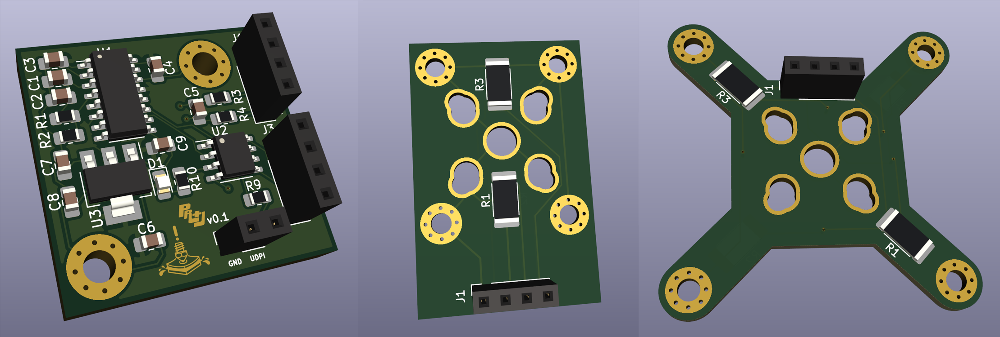

    <picture>
        <source media="(prefers-color-scheme: dark)" srcset="./images/dark.svg" | width=300>
        <source media="(prefers-color-scheme: light)" srcset="./images/light.svg" | width=300>
        
    </picture>

## PR and what now?
PR&J is the second name of this project after realizing two things
- I'd like to be able to put this on a resume
- Realizing the main features are as follows
	- Probing
    - Jam detection
    - & Runout detection
> This board also is sandwiched between the hotend and extruder, thus a PR&J

## How does a load cell do all that?
The way this design is set to work is there will be a strain gauge between the extruder and hotend with a set of resistors on it
When the board experiences even the slightest bit of strain, the value of these resistors changes slightly, and this change is amplified by the tried and true HX717 24 bit amplifier
This signal is then interpreted by an on board ATTiny202 that processes the signal and then outputs said signal over I2C to a klipper MCU

Though the first idea that comes to mind with load cells is probing (which is still the main feature of this project), the ability to detect this strain can also be used to interpret forces between the hotend and extruder in both positive and negative directions
We're still workshopping ideas that could come from this one feature but some we would like to consider are:
- Runout detection
- Jam detection
- Detecting skipped steps
- One-click pressure advance tuning
- One-click max flow rate calculation
Some "theoreticals" that will need extensive testing but may be possible:
- Spaghetti detection
- Crash detection
- Flow rate change compensation

## Sign me up!
Actually I'd love to! right now we're starting a small beta test group for main boards and two strain gauges, these haven't been adapted to any toolhead yet so initial testing likely will not involve much printing, but getting as much data as possible to characterize how these strain gauges behave will let our crazy ideas become a reality
We're also looking for people that may have experience with any of the following for helping with development of the project itself
- Programmers especially familiar with klipper
- Electronics engineers
- CAD experts
If you'd like to help at all, current discussions are in the [Armchair Engineering discord server](https://discord.gg/armchairengineeringsux) in [this](https://discord.com/channels/1029426383614648421/1141480604844703745) channel

## What now?
As of making this repository parts are on the way and boards are almost ready to be ordered, and testers are being selected, the first wave of test boards will only include about 10 main boards, as well as 20 strain gauges (10 of each design)
Updates will be regularly made in the discord channel, feel free to reach out to me there or via [my discord](https://discord.com/users/96435324275658752)

Here's what we've got so far :)

<picture>
  <source srcset="./images/boards.png">
  
</picture>

## Helpers
- Electronics
    - fisheiyy
    - [whoppingpochard](https://github.com/tanaes)
    - [calithameridi](http://github.com/calithameridi/)
- Hardware
    - [whoppingpochard](https://github.com/tanaes)
    - [bwnance](https://github.com/bwnance)
